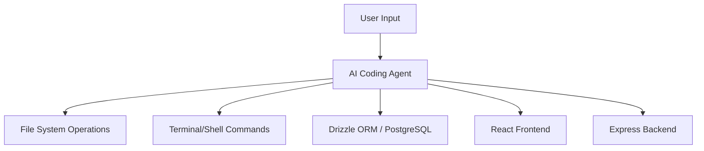

# AI Coding Agent System Reference Guide

This document serves as the primary technical reference for the AI Coding Agent system integrated into the **Data-Explorer** project. It outlines the architecture, implementation guidelines, and operational protocols for maintaining and evolving the system effectively.

---

## **Architecture Overview**

The AI Coding Agent operates as a high-level orchestrator within the Replit/Trae environment, leveraging a full-stack TypeScript architecture.

### **System Components**
- **Orchestration Layer**: Manages the interaction between the LLM (Gemini/GPT-4) and the local filesystem.
- **Frontend (Client)**: A modern React application built with Vite, Tailwind CSS, and Shadcn UI.
- **Backend (Server)**: An Express-based Node.js server handling API requests and business logic.
- **Persistence (Database)**: PostgreSQL managed via Drizzle ORM for type-safe database interactions.

### **Data Flow Diagram**


---

## **Technical Specifications**

### **Core Stack**
- **Runtime**: Node.js (v20+)
- **Languages**: TypeScript (Strict Mode)
- **Frontend**: 
    - [React 19](https://react.dev)
    - [Vite](https://vitejs.dev)
    - [Tailwind CSS 4.0](https://tailwindcss.com)
    - [Shadcn UI](https://ui.shadcn.com)
    - [Framer Motion](https://www.framer.com/motion/)
- **Backend**:
    - [Express 5.0](https://expressjs.com)
    - [Drizzle ORM](https://orm.drizzle.team)
    - [Zod](https://zod.dev) (Validation)
    - [Passport.js](http://www.passportjs.org) (Authentication)

### **Infrastructure**
- **Environment**: Replit / Windows (Local Development)
- **Build System**: Custom `esbuild` + `vite` pipeline ([build.ts](file:///j:/Data-Explorer/script/build.ts))
- **Database**: Managed PostgreSQL instance.

---

## **Implementation Guidelines**

### **1. Coding Standards**
- **Type Safety**: Use TypeScript for all new components. Avoid `any` at all costs.
- **Component Structure**: Use functional components with hooks. Prefer the `client/src/components/ui` library for base elements.
- **State Management**: Use `@tanstack/react-query` for server-state and standard React hooks for local state.

### **2. Database Migrations**
- Schema changes must be defined in [schema.ts](file:///j:/Data-Explorer/shared/schema.ts).
- Run `npm run db:push` to sync the schema with the database during development.

### **3. Error Handling**
- Use `zod` for request validation in [routes.ts](file:///j:/Data-Explorer/server/routes.ts).
- Centralized error handling is implemented in [index.ts](file:///j:/Data-Explorer/server/index.ts) via Express middleware.

---

## **API Documentation**

### **Internal API Structure**
All API endpoints are prefixed with `/api`.

| Endpoint | Method | Description |
|----------|--------|-------------|
| `/api/auth/login` | `POST` | User authentication |
| `/api/auth/register` | `POST` | New user registration |
| `/api/data` | `GET` | Retrieve explorer data (Mocked in current version) |

### **Example Request**
```typescript
const response = await fetch('/api/auth/login', {
  method: 'POST',
  body: JSON.stringify({ username: 'admin', password: 'password' }),
  headers: { 'Content-Type': 'application/json' }
});
```

---

## **Configuration Parameters**

### **Environment Variables**
| Variable | Description | Default |
|----------|-------------|---------|
| `PORT` | The port the server listens on | `5000` |
| `DATABASE_URL` | PostgreSQL connection string | *Required* |
| `NODE_ENV` | Environment mode | `development` |
| `SESSION_SECRET` | Secret key for session management | *Required* |

---

## **Usage Examples**

### **Creating a New UI Component**
```tsx
import { Button } from "@/components/ui/button";

export function CustomAction() {
  return (
    <Button onClick={() => console.log("Agent Triggered")}>
      Analyze Data
    </Button>
  );
}
```

### **Adding a New Database Table**
1. Edit [schema.ts](file:///j:/Data-Explorer/shared/schema.ts).
2. Export the table and its Zod schemas.
3. Run `npm run db:push`.

---

## **Deployment Procedures**

### **Build Pipeline**
1. **Client Build**: `vite build` generates the static assets in `dist/public`.
2. **Server Build**: `esbuild` bundles [index.ts](file:///j:/Data-Explorer/server/index.ts) into `dist/index.cjs`.
3. **Execution**: `node dist/index.cjs` starts the production server.

### **Command**
```bash
npm run build
npm start
```

---

## **Maintenance Protocols**

### **State Management**
The agent maintains state files in `.local/state/replit/agent/`. If the agent becomes unresponsive or exhibits circular behavior:
1. Stop the current command.
2. Verify [package.json](file:///j:/Data-Explorer/package.json) dependencies.
3. Restart the dev server with `npm run dev`.

### **Troubleshooting Guide**
- **Port Conflict**: If port 5000 is taken, the server will fail. Ensure no other instances are running.
- **Database Connection**: Verify `DATABASE_URL` if `db:push` fails.
- **Vite HMR**: If changes don't reflect in the browser, check the browser console for connection errors to the Vite dev server.

---

## **Security Guidelines**
- Never commit `.env` files.
- Use `passport` for secure session management.
- Sanitize all user inputs via `zod` before database insertion.

---
*Last Updated: 2026-02-11*
